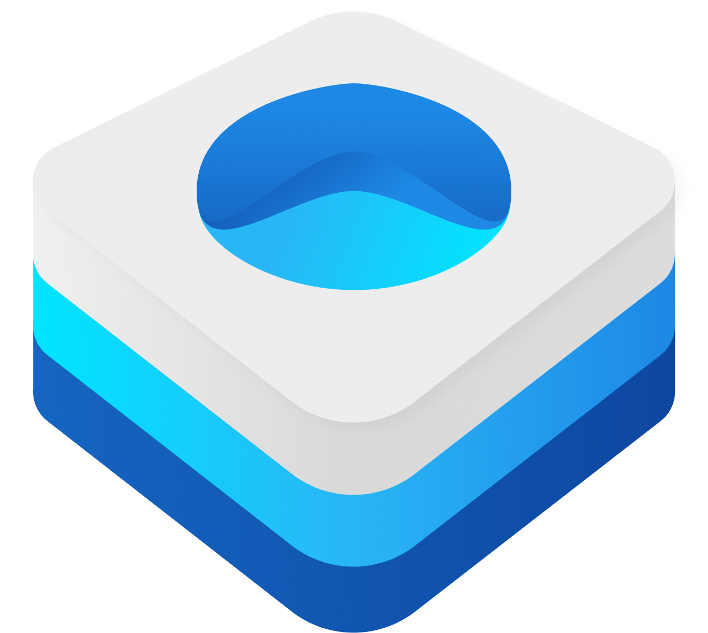

 

# Transmission

`Transmission` aims to improve SwiftUI view presentations and transitions. It does this by bridging UIKit presentation APIs to a SwiftUI API so you can use presentation controllers, interactive transitions and more.

> Built using [Engine](https://github.com/nathantannar4/Engine)

## See Also

- [Turbocharger](https://github.com/nathantannar4/Turbocharger)
- [Ignition](https://github.com/nathantannar4/Ignition)

## Preview


## Requirements

- Deployment target: iOS 13.0, macOS 10.15, tvOS 13.0, or watchOS 6.0
- Xcode 15+

## Installation

### Xcode Projects

Select `File` -> `Swift Packages` -> `Add Package Dependency` and enter `https://github.com/nathantannar4/Transmission`.

### Swift Package Manager Projects

You can add `Transmission` as a package dependency in your `Package.swift` file:

```swift
let package = Package(
    //...
    dependencies: [
        .package(url: "https://github.com/nathantannar4/Transmission"),
    ],
    targets: [
        .target(
            name: "YourPackageTarget",
            dependencies: [
                .product(name: "Transmission", package: "Transmission"),
            ],
            //...
        ),
        //...
    ],
    //...
)
```

### Xcode Cloud / Github Actions / Fastlane / CI

[Engine](https://github.com/nathantannar4/Engine) includes a Swift macro, which requires user validation to enable or the build will fail. When configuring your CI, pass the flag `-skipMacroValidation` to `xcodebuild` to fix this.

## Introduction to Transmission

For some sample code to get started with `Transmission`, build and run the included "Example" project.

### PresentationLink

```swift
@available(iOS 14.0, *)
public struct PresentationLinkTransition {

    public static var `default`: PresentationLinkTransition

    public static let sheet: PresentationLinkTransition
    public static func sheet(
        selected: Binding<SheetTransitionOptions.Detent.Identifier?>? = nil,
        detents: [SheetTransitionOptions.Detent]
    ) -> PresentationLinkTransition
    
    public static let currentContext: PresentationLinkTransition
    public static let fullscreen: PresentationLinkTransition
    public static let popover: PresentationLinkTransition
    public static let slide: PresentationLinkTransition

    public static func custom<T: PresentationLinkCustomTransition>(_ transition: T) -> PresentationLinkTransition
}

@available(iOS 15.0, *)
extension SheetTransitionOptions.Detent {
    
    /// Creates a large detent.
    public static let large: Detent

    /// Creates a medium detent.
    public static let medium: Detent

    /// Creates a detent with an auto-resolved height of the views ideal size.
    public static let ideal: Detent

    /// Creates a detent with a constant height.
    public static func constant(_ identifier: Identifier, height: CGFloat) -> Detent
    
    /// Creates a detent that's height is lazily resolved.
    public static func custom(
        _ identifier: Identifier,
        resolver: @escaping (ResolutionContext) -> CGFloat?
    ) -> Detent
}

/// A protocol that defines a custom transition for a ``PresentationLinkTransition``
@available(iOS 14.0, *)
public protocol PresentationLinkCustomTransition {

    func presentationController(
        sourceView: UIView,
        presented: UIViewController,
        presenting: UIViewController?
    ) -> UIPresentationController

    func animationController(
        forPresented presented: UIViewController,
        presenting: UIViewController
    ) -> UIViewControllerAnimatedTransitioning?

    func animationController(
        forDismissed dismissed: UIViewController
    ) -> UIViewControllerAnimatedTransitioning?

    func interactionControllerForPresentation(
        using animator: UIViewControllerAnimatedTransitioning
    ) -> UIViewControllerInteractiveTransitioning?

    func interactionControllerForDismissal(
        using animator: UIViewControllerAnimatedTransitioning
    ) -> UIViewControllerInteractiveTransitioning?
}

@available(iOS 14.0, *)
@frozen
public struct PresentationCoordinator {

    public var isPresented: Bool

    @inlinable
    public func dismiss(animation: Animation? = .default)
    
    @inlinable
    public func dismiss(transaction: Transaction)
}

@available(iOS 14.0, *)
extension EnvironmentValues {
    public var presentationCoordinator: PresentationCoordinator { get }
}

/// A button that presents a destination view in a new `UIViewController`.
///
/// The destination view is presented with the provided `transition`.
/// By default, the ``PresentationLinkTransition/default`` transition is used.
///
/// > Tip: You can implement custom transitions with a `UIPresentationController` and/or
/// `UIViewControllerInteractiveTransitioning` with the ``PresentationLinkTransition/custom(_:)``
///  transition.
///
@available(iOS 14.0, *)
@frozen
public struct PresentationLink<
    Label: View,
    Destination: View
>: View {

    public init(
        @ViewBuilder destination: () -> Destination,
        @ViewBuilder label: () -> Label
    )

    public init(
        transition: PresentationLinkTransition = .default,
        @ViewBuilder destination: () -> Destination,
        @ViewBuilder label: () -> Label
    )

    public init(
        isPresented: Binding<Bool>,
        @ViewBuilder destination: () -> Destination,
        @ViewBuilder label: () -> Label
    )

    public init(
        transition: PresentationLinkTransition,
        isPresented: Binding<Bool>,
        @ViewBuilder destination: () -> Destination,
        @ViewBuilder label: () -> Label
    )
}

@available(iOS 14.0, *)
extension PresentationLink {
    public init<ViewController: UIViewController>(
        destination: @escaping () -> ViewController,
        @ViewBuilder label: () -> Label
    )

    public init<ViewController: UIViewController>(
        transition: PresentationLinkTransition,
        destination: @escaping () -> ViewController,
        @ViewBuilder label: () -> Label
    )

    public init<ViewController: UIViewController>(
        isPresented: Binding<Bool>,
        destination: @escaping () -> ViewController,
        @ViewBuilder label: () -> Label
    )

    public init<ViewController: UIViewController>(
        transition: PresentationLinkTransition,
        isPresented: Binding<Bool>,
        destination: @escaping () -> ViewController,
        @ViewBuilder label: () -> Label
    )
}

@available(iOS 14.0, *)
extension PresentationLinkModifier {
    public init(
        transition: PresentationLinkTransition = .default,
        isPresented: Binding<Bool>,
        @ViewBuilder destination: () -> Destination
    )
}

@available(iOS 14.0, *)
extension View {

    /// A modifier that presents a destination view in a new `UIViewController`.
    public func presentation<Destination: View>(
        transition: PresentationLinkTransition = .default,
        isPresented: Binding<Bool>,
        @ViewBuilder destination: () -> Destination
    ) -> some View

    /// A modifier that presents a destination view in a new `UIViewController`.
    public func presentation<T, Destination: View>(
        _ value: Binding<T?>,
        transition: PresentationLinkTransition = .default,
        @ViewBuilder destination: (Binding<T>) -> Destination
    ) -> some View
}
```

### TransitionReader

```swift
/// A container view that defines its content as a function of its hosting view's
/// `UIViewControllerTransitionCoordinator` transition progress.
///
/// > Tip: Use a ``TransitionReader`` to build interactive presentation and dismissal
/// transitions
/// 
public struct TransitionReader<Content: View>: View {
    public struct Proxy {
        /// The progress state of the transition from 0 to 1 where 1 is fully presented
        public var progress: CGFloat
    }

    public init(@ViewBuilder content: @escaping (Proxy) -> Content)
}
```

### StatusBar Style/Hidden

```swift
@available(iOS 14.0, *)
extension View {

    /// Sets the preferred status bar style of the hosting views `UIViewController`
    public func preferredStatusBarStyle(_ style: UIStatusBarStyle) -> some View

    /// Sets the preferred status bar visibility of the hosting views `UIViewController`
    public func prefersStatusBarHidden(_ isHidden: Bool = true) -> some View
}

```

### WindowLink

```swift
@available(iOS 14.0, *)
public struct WindowLinkLevel {

    public static var `default`: WindowLinkLevel

    public static var overlay: WindowLinkLevel

    public static var background: WindowLinkLevel
    
    public static let alert: WindowLinkLevel

    public static func custom(_ level: CGFloat) -> WindowLinkLevel
}

@available(iOS 14.0, *)
public struct WindowLinkTransition {

    public static let identity: WindowLinkTransition

    public static let opacity: WindowLinkTransition

    public static func move(edge: Edge) -> WindowLinkTransition

    public static func scale(_ multiplier: CGFloat) -> WindowLinkTransition
}

extension WindowLinkTransition {
    public func combined(with other: WindowLinkTransition) -> WindowLinkTransition
}

/// A button that presents a destination view in a new `UIWindow`.
@available(iOS 14.0, *)
@frozen
public struct WindowLink<
    Label: View,
    Destination: View
>: View {

    public init(
        level: WindowLinkLevel = .default,
        transition: WindowLinkTransition = .opacity,
        @ViewBuilder destination: () -> Destination,
        @ViewBuilder label: () -> Label
    )

    public init(
        level: WindowLinkLevel = .default,
        transition: WindowLinkTransition = .opacity,
        isPresented: Binding<Bool>,
        @ViewBuilder destination: () -> Destination,
        @ViewBuilder label: () -> Label
    )
}

@available(iOS 14.0, *)
extension View {

    /// A modifier that presents a destination view in a new `UIWindow`
    public func window<Destination: View>(
        level: WindowLinkLevel = .default,
        transition: WindowLinkTransition = .opacity,
        isPresented: Binding<Bool>,
        @ViewBuilder destination: () -> Destination
    ) -> some View

    /// A modifier that presents a destination view in a new `UIWindow`
    public func window<T, D: View>(
        _ value: Binding<T?>,
        level: WindowLinkLevel = .default,
        transition: WindowLinkTransition = .opacity,
        @ViewBuilder destination: (Binding<T>) -> D
    ) -> some View
}
```

### ShareSheetLink

```swift
/// A protocol that defines an interface for creating activities for a `UIActivityViewController`
@available(iOS 14.0, *)
public protocol ShareSheetItemProvider {
    func makeUIActivityItemSource(context: Context) -> UIActivityItemSource
    func makeUIActivity(context: Context) -> UIActivity?

    typealias Context = ShareSheetItemProviderContext
}

/// A share sheet provider for a string.
@available(iOS 14.0, *)
extension String: ShareSheetItemProvider {
    public func makeUIActivityItemSource(context: Context) -> UIActivityItemSource
}

/// A share sheet provider for a url.
@available(iOS 14.0, *)
extension URL: ShareSheetItemProvider {
    public func makeUIActivityItemSource(context: Context) -> UIActivityItemSource
}

/// A share sheet provider for generating an image from a view.
@available(iOS 14.0, *)
@frozen
public struct SnapshotItemProvider<Content: View>: ShareSheetItemProvider {

    public init(label: LocalizedStringKey, content: Content) {
        self.label = Text(label)
        self.content = content
    }
}

/// A button that presents a `UIActivityViewController`
@available(iOS 14.0, *)
@frozen
public struct ShareSheetLink<
    Label: View
>: View {

    public init(
        items: [ShareSheetItemProvider],
        action: ((Result<UIActivity.ActivityType?, Error>) -> Void)? = nil,
        @ViewBuilder label: () -> Label
    )

    public init(
        items: [ShareSheetItemProvider],
        action: ((Result<UIActivity.ActivityType?, Error>) -> Void)? = nil,
        isPresented: Binding<Bool>,
        @ViewBuilder label: () -> Label
    )
}

@available(iOS 14.0, *)
extension View {
    
    /// A modifier that presents a `UIActivityViewController`
    public func share(
        items: [ShareSheetItemProvider],
        isPresented: Binding<Bool>,
        action: ((Result<UIActivity.ActivityType?, Error>) -> Void)? = nil
    ) -> some View
}
```

## License

Distributed under the BSD 2-Clause License. See ``LICENSE.md`` for more information.
